# Design Document

## Overview

This design addresses the critical DSQL locking compatibility issue that prevents Temporal from functioning with Aurora DSQL. The core challenge is that Aurora DSQL only supports `FOR UPDATE` locking clauses, while Temporal's PostgreSQL plugin uses `FOR SHARE` (read locks) which are not supported by DSQL.

**Actual Problematic Patterns Identified:**
- `FOR SHARE` in PostgreSQL shard and execution locking (temporal-dsql/common/persistence/sql/sqlplugin/postgresql/)
- `LOCK IN SHARE MODE` in MySQL plugin (not directly affecting DSQL but shows the pattern)

The solution involves implementing DSQL-specific method overrides that replace `FOR SHARE` read locks with optimistic concurrency control (OCC) patterns and proper transaction retry logic.

Removal of FOR SHARE is an all-or-nothing decision per method. If any downstream mutation path lacks adequate fencing, the DSQL plugin must retain FOR UPDATE semantics for that method. Mixed behavior is explicitly disallowed.

In DSQL, conflicts may surface either during statement execution or at transaction commit. Both cases are treated identically: the transaction is rolled back and retried only when SQLSTATE 40001 is observed.

## Architecture

### Proposed Architecture

```mermaid
graph TD
    A[Temporal Services] --> B[SQL Plugin Interface]
    B --> C{Database Type}
    C -->|PostgreSQL| D[PostgreSQL Plugin]
    C -->|DSQL| E[DSQL Plugin]
    
    E --> F[Method Overrides]
    F --> G[RunTxWithRetry Wrapper]
    G --> H[DSQL Database]
    
    I[DSQL Operations] --> J[FOR UPDATE ✓]
    I --> K[Conditional UPDATE ✓]
    I --> L[OCC + Retry ✓]
    
    style J fill:#99ff99
    style K fill:#99ff99
    style L fill:#99ff99
```



## Components and Interfaces

### 1. DSQL Plugin Method Overrides

**Location:** `common/persistence/sql/sqlplugin/dsql/`

**Approach:** Override only the specific methods that use unsupported FOR SHARE locking, rather than implementing a generic query transformer.

**Concrete Methods Requiring DSQL-Specific Implementation:**

| Interface  | Method                 | Current PostgreSQL Pattern                                                                 | DSQL Pattern                                                     | Call-Site Contract |
|------------|------------------------|---------------------------------------------------------------------------------------------|------------------------------------------------------------------|--------------------|
| Shard      | ReadLockShards         | SELECT range_id FROM shards WHERE shard_id = $1 FOR SHARE                                    | SELECT range_id FROM shards WHERE shard_id = $1                  | Safe to remove FOR SHARE: Used only to fetch current range_id for validation. Caller compares with expected range_id and returns ShardOwnershipLostError if different. No subsequent write in same transaction. |
| Execution  | ReadLockExecutions     | SELECT db_record_version, next_event_id FROM executions WHERE ... FOR SHARE                  | SELECT db_record_version, next_event_id FROM executions WHERE ...| REQUIRES INVESTIGATION: Used to fetch fencing tokens (db_record_version, next_event_id). Must verify all subsequent writes use proper CAS fencing. If no adequate fencing exists, keep FOR UPDATE instead of removing FOR SHARE. |
| Shard      | WriteLockShards        | SELECT range_id FROM shards WHERE shard_id = $1 FOR UPDATE                                   | Same (supported)                                                 | Syntax unchanged; semantics require retry: FOR UPDATE works but doesn’t block in DSQL. Must wrap in RunTxWithRetry and handle SQLSTATE 40001 conflicts. |
| TaskQueue  | LockTaskQueue          | SELECT range_id FROM task_queues_v2 WHERE ... FOR UPDATE                                     | Same (supported)                                                 | Syntax unchanged; semantics require retry: FOR UPDATE works but doesn’t block in DSQL. Must wrap in RunTxWithRetry. All updates must use CAS with range_id fencing. |
| Namespace  | LockNamespaceMetadata  | SELECT notification_version FROM namespace_metadata WHERE ... FOR UPDATE                    | Same (supported)                                                 | Syntax unchanged; semantics require retry: FOR UPDATE works but doesn’t block in DSQL. Must wrap in RunTxWithRetry. Updates must use CAS with notification_version fencing. |

**Key implementation:**

```go
type DSQLPlugin struct {
    *postgresql.Plugin
    retryManager *RetryManager
}

// Override ReadLockShards - safe to remove FOR SHARE
// Call-site contract: Used only for range_id validation, no subsequent writes
func (p *DSQLPlugin) ReadLockShards(ctx context.Context, filter ShardsFilter) (int64, error) {
    return RunTxWithRetry(ctx, p.db, func(tx *sql.Tx) (int64, error) {
        var rangeID int64
        err := tx.QueryRowContext(ctx, 
            "SELECT range_id FROM shards WHERE shard_id = $1", 
            filter.ShardID).Scan(&rangeID)
        return rangeID, err
    })
}

// ReadLockExecutions - REQUIRES INVESTIGATION before removing FOR SHARE
// Must verify all call sites have proper CAS fencing on subsequent writes
func (p *DSQLPlugin) ReadLockExecutions(ctx context.Context, filter ExecutionsFilter) (int64, int64, error) {
    // TODO: Investigate all call sites to ensure proper fencing exists
    // If no adequate CAS fencing found, keep FOR UPDATE instead of removing FOR SHARE
    // 
    // Required analysis:
    // 1. Which subsequent updates consume this read?
    // 2. What exact fence tokens do callers already enforce?
    // 3. If no fence exists, DSQL plugin must add one or keep FOR UPDATE
    
    type result struct {
        dbVersion   int64
        nextEventID int64
    }
    
    res, err := RunTxWithRetry(ctx, p.db, func(tx *sql.Tx) (result, error) {
        var r result
        err := tx.QueryRowContext(ctx,
            "SELECT db_record_version, next_event_id FROM executions WHERE shard_id = $1 AND namespace_id = $2 AND workflow_id = $3 AND run_id = $4",
            filter.ShardID, filter.NamespaceID, filter.WorkflowID, filter.RunID).Scan(&r.dbVersion, &r.nextEventID)
        return r, err
    })
    
    return res.dbVersion, res.nextEventID, err
}

// WriteLockShards - syntax unchanged but must wrap in retry
// Call-site contract: All subsequent updates must use CAS with range_id fencing
func (p *DSQLPlugin) WriteLockShards(ctx context.Context, filter ShardsFilter) (int64, error) {
    return RunTxWithRetry(ctx, p.db, func(tx *sql.Tx) (int64, error) {
        var rangeID int64
        err := tx.QueryRowContext(ctx,
            "SELECT range_id FROM shards WHERE shard_id = $1 FOR UPDATE",
            filter.ShardID).Scan(&rangeID)
        return rangeID, err
    })
}

// Example of proper CAS update pattern
func (p *DSQLPlugin) UpdateShardWithCAS(ctx context.Context, shardID int32, newRangeID, expectedRangeID int64) error {
    return RunTxWithRetryVoid(ctx, p.db, func(tx *sql.Tx) error {
        result, err := tx.ExecContext(ctx,
            "UPDATE shards SET range_id = $1 WHERE shard_id = $2 AND range_id = $3",
            newRangeID, shardID, expectedRangeID)
        if err != nil {
            return err
        }
        
        rowsAffected, err := result.RowsAffected()
        if err != nil {
            return err
        }
        
        if rowsAffected == 0 {
            return &ConditionFailedError{Msg: fmt.Sprintf("shard %d range_id changed from %d", shardID, expectedRangeID)}
        }
        
        return nil
    })
}
```

### Idempotency Requirement

All transactional bodies executed under `RunTxWithRetry` must be free of externally visible side effects (e.g. emitting signals, writing to external systems, publishing metrics with semantic meaning) unless those effects are themselves idempotent.

Persistence mutations are safe due to CAS fencing; external side effects are not automatically protected.

### Investigation Required: Execution Fencing Analysis

Before implementing ReadLockExecutions override, must analyze:

1. **Call Site Analysis**: For each usage of ReadLockExecutions, identify:
   - Which subsequent UPDATE operations consume this read?
   - What exact fencing tokens do those UPDATEs already enforce?
   - Are there multi-table updates that require atomic coordination?

2. **Fencing Token Validation**: Verify that execution updates use adequate CAS patterns:
   - `db_record_version` fencing for execution state changes
   - `next_event_id` fencing for event ordering
   - Combined fencing for complex state transitions
   - Cross-table consistency (executions + current_executions)

3. **Decision Criteria**:
   - **If adequate CAS fencing exists**: Safe to remove FOR SHARE
   - **If no adequate fencing exists**: Keep FOR UPDATE or add proper CAS
   - **If uncertain**: Keep FOR UPDATE (safer default)

**Implementation Priority**: Start with ReadLockShards (proven safe), then investigate execution patterns before proceeding.

### 2. RunTxWithRetry Wrapper

**Location:** `common/persistence/sql/sqlplugin/dsql/retry.go`

**Responsibilities:**
- Wrap all DSQL operations in transaction retry logic with proper return value support
- Handle DSQL-specific serialization conflicts (SQLSTATE 40001)
- Implement exponential backoff with jitter
- Explicitly exclude ConditionFailedError from retries

#### Retry Exclusion Rule

> **CRITICAL:** ConditionFailedError MUST NEVER be retried automatically.
> It represents a normal CAS ownership-loss outcome.

**Implementation:**

```go
type RetryManager struct {
    db      *sql.DB
    config  RetryConfig
    logger  log.Logger
    metrics *RetryMetrics
}

type RetryConfig struct {
    MaxRetries   int           // 5
    BaseDelay    time.Duration // 100ms
    MaxDelay     time.Duration // 5s
    JitterFactor float64       // 0.25
}

// Generic retry helper for operations with return values
func RunTxWithRetry[T any](ctx context.Context, db *sql.DB, fn func(*sql.Tx) (T, error)) (T, error) {
    var zero T
    var lastErr error

    // In production, source maxRetries from configuration (e.g., RetryManager.config.MaxRetries).
    // For this design doc pseudocode, treat maxRetries as the configured retry budget.
    maxRetries := 5
    
    for attempt := 0; attempt <= maxRetries; attempt++ {
        tx, err := db.BeginTx(ctx, nil)
        if err != nil {
            return zero, err
        }
        
        result, err := fn(tx)
        if err != nil {
            _ = tx.Rollback()
            
            // CRITICAL: Never retry ConditionFailedError
            if IsConditionFailedError(err) {
                return zero, err
            }
            
            // Only retry DSQL serialization conflicts
            if !isRetryableError(err) {
                return zero, err
            }
            
            lastErr = err
            if attempt < maxRetries {
                delay := calculateBackoff(attempt)
                select {
                case <-time.After(delay):
                case <-ctx.Done():
                    return zero, ctx.Err()
                }
                continue
            }
            return zero, err
        }

        err = tx.Commit()
        if err != nil {
            // Commit-time conflicts are handled the same way: retry only on SQLSTATE 40001
            if IsConditionFailedError(err) {
                return zero, err
            }
            if isRetryableError(err) && attempt < maxRetries {
                lastErr = err
                delay := calculateBackoff(attempt)
                select {
                case <-time.After(delay):
                case <-ctx.Done():
                    return zero, ctx.Err()
                }
                continue
            }
            return zero, err
        }
        
        return result, nil
    }
    
    return zero, fmt.Errorf("max retries exceeded: %w", lastErr)
}

// Simple retry helper for operations without return values
func RunTxWithRetryVoid(ctx context.Context, db *sql.DB, fn func(*sql.Tx) error) error {
    _, err := RunTxWithRetry(ctx, db, func(tx *sql.Tx) (struct{}, error) {
        return struct{}{}, fn(tx)
    })
    return err
}

func isRetryableError(err error) bool {
    return classifyError(err) == ErrorTypeRetryable
}

// Canonical error classifier for DSQL operations
func classifyError(err error) ErrorType {
    // CRITICAL: Never retry condition failures
    if IsConditionFailedError(err) {
        return ErrorTypeConditionFailed
    }
    
    var pgErr *pgconn.PgError
    if errors.As(err, &pgErr) {
        switch pgErr.SQLState() {
        case "40001":
            return ErrorTypeRetryable // DSQL serialization conflict
        case "0A000":
            return ErrorTypePermanent // Unsupported feature (implementation bug)
        default:
            return ErrorTypePermanent
        }
    }
    
    // Don't retry timeouts - they indicate system overload
    if errors.Is(err, context.DeadlineExceeded) {
        return ErrorTypePermanent
    }
    
    // Don't retry connection errors for now - may add specific cases later
    return ErrorTypePermanent
}

type ErrorType int

const (
    ErrorTypeRetryable ErrorType = iota
    ErrorTypeConditionFailed
    ErrorTypePermanent
)
```

### 4. DSQL Compatibility Method Inventory

**Complete review of all sqlplugin interfaces for DSQL compatibility:**

| Interface        | Method                         | Status                | Action Required                                                                 |
|------------------|--------------------------------|------------------------|---------------------------------------------------------------------------------|
| Shard            | InsertIntoShards               | ✅ Unchanged           | None – standard INSERT                                                          |
| Shard            | UpdateShards                   | ⚠️ Needs CAS           | Ensure all calls use range_id fencing                                           |
| Shard            | SelectFromShards               | ✅ Unchanged           | None – standard SELECT                                                          |
| Shard            | ReadLockShards                 | 🔧 Remove FOR SHARE    | Override to remove FOR SHARE clause                                             |
| Shard            | WriteLockShards                | ⚠️ Needs Retry         | Wrap in RunTxWithRetry                                                          |
| Execution        | InsertIntoExecutions           | ✅ Unchanged           | None – standard INSERT                                                          |
| Execution        | UpdateExecutions               | ⚠️ Needs CAS           | Ensure all calls use db_record_version + next_event_id fencing                  |
| Execution        | SelectFromExecutions           | ✅ Unchanged           | None – standard SELECT                                                          |
| Execution        | DeleteFromExecutions           | ✅ Unchanged           | None – standard DELETE                                                          |
| Execution        | ReadLockExecutions             | 🔧 Remove FOR SHARE    | Override to remove FOR SHARE clause (only after fencing analysis)               |
| Execution        | WriteLockExecutions            | ⚠️ Needs Retry         | Wrap in RunTxWithRetry                                                          |
| CurrentExecution | InsertIntoCurrentExecutions    | ✅ Unchanged           | None – standard INSERT                                                          |
| CurrentExecution | UpdateCurrentExecutions        | ⚠️ Needs CAS           | Ensure all calls use run_id fencing                                             |
| CurrentExecution | SelectFromCurrentExecutions    | ✅ Unchanged           | None – standard SELECT                                                          |
| CurrentExecution | DeleteFromCurrentExecutions    | ✅ Unchanged           | None – standard DELETE                                                          |
| CurrentExecution | LockCurrentExecutions          | ⚠️ Needs Retry         | Wrap in RunTxWithRetry (FOR UPDATE supported)                                   |
| TaskQueue        | InsertIntoTaskQueues           | ✅ Unchanged           | None – standard INSERT                                                          |
| TaskQueue        | UpdateTaskQueues               | ⚠️ Needs CAS           | Ensure all calls use range_id fencing                                           |
| TaskQueue        | SelectFromTaskQueues           | ✅ Unchanged           | None – standard SELECT                                                          |
| TaskQueue        | DeleteFromTaskQueues           | ✅ Unchanged           | None – standard DELETE                                                          |
| TaskQueue        | LockTaskQueues                 | ⚠️ Needs Retry         | Wrap in RunTxWithRetry (FOR UPDATE supported)                                   |
| Namespace        | InsertIntoNamespace            | ✅ Unchanged           | None – standard INSERT                                                          |
| Namespace        | UpdateNamespace                | ⚠️ Needs CAS           | Ensure all calls use notification_version fencing                               |
| Namespace        | SelectFromNamespace            | ✅ Unchanged           | None – standard SELECT                                                          |
| Namespace        | DeleteFromNamespace            | ✅ Unchanged           | None – standard DELETE                                                          |
| Namespace        | LockNamespaceMetadata          | ⚠️ Needs Retry         | Wrap in RunTxWithRetry (FOR UPDATE supported)                                   |
| Queue            | InsertIntoQueue                | ✅ Unchanged           | None – standard INSERT                                                          |
| Queue            | SelectFromQueue                | ✅ Unchanged           | None – standard SELECT                                                          |
| Queue            | DeleteFromQueue                | ✅ Unchanged           | None – standard DELETE                                                          |
| Queue            | GetLastEnqueuedMessageID       | ⚠️ Review Needed       | Check if uses FOR UPDATE – may need retry wrapper                               |
| Queue            | LockQueueMetadata              | ⚠️ Needs Retry         | Wrap in RunTxWithRetry (FOR UPDATE supported)                                   |
| ClusterMetadata  | InsertIntoClusterMetadata      | ✅ Unchanged           | None – standard INSERT                                                          |
| ClusterMetadata  | UpdateClusterMetadata          | ⚠️ Needs CAS           | Ensure all calls use version fencing                                            |
| ClusterMetadata  | SelectFromClusterMetadata      | ✅ Unchanged           | None – standard SELECT                                                          |
| ClusterMetadata  | DeleteFromClusterMetadata      | ✅ Unchanged           | None – standard DELETE                                                          |
| ClusterMetadata  | WriteLockGetClusterMetadata    | ⚠️ Needs Retry         | Wrap in RunTxWithRetry (FOR UPDATE supported)                                   |

### 5. Condition Failed Error Handling

**Location:** `common/persistence/sql/sqlplugin/dsql/errors.go`

**Purpose:** Distinguish between retryable DSQL conflicts and CAS condition failures

```go
type ConditionFailedError struct {
    Msg string
}

func (e *ConditionFailedError) Error() string {
    return fmt.Sprintf("condition failed: %s", e.Msg)
}

// IsConditionFailedError checks if error is a CAS condition failure
// These should NOT be retried automatically - they indicate ownership lost
func IsConditionFailedError(err error) bool {
    _, ok := err.(*ConditionFailedError)
    return ok
}

// Convert to appropriate Temporal error types
func (e *ConditionFailedError) ToTemporalError() error {
    // Map to existing Temporal error types based on context
    if strings.Contains(e.Msg, "shard") {
        return &persistence.ShardOwnershipLostError{Msg: e.Msg}
    }
    if strings.Contains(e.Msg, "execution") {
        return &persistence.ConditionFailedError{Msg: e.Msg}
    }
    return serviceerror.NewUnavailable(e.Msg)
}
```

## Data Models

### Shard Locking Model

**Current PostgreSQL Pattern:**

```sql
-- Read lock (problematic - FOR SHARE not supported)
SELECT range_id FROM shards WHERE shard_id = $1 FOR SHARE

-- Write lock (supported)
SELECT range_id FROM shards WHERE shard_id = $1 FOR UPDATE

-- Update shard
UPDATE shards SET range_id = range_id + 1 WHERE shard_id = $1
```

**DSQL-Compatible Pattern (Syntax unchanged; semantics require retry):**

```sql
-- Write lock (FOR UPDATE syntax works but doesn't block in DSQL)
SELECT range_id FROM shards WHERE shard_id = $1 FOR UPDATE

-- Conditional update with CAS fencing (CRITICAL for correctness)
UPDATE shards 
SET range_id = $1, updated_at = NOW() 
WHERE shard_id = $2 AND range_id = $3
-- Check rowsAffected == 1 for success, == 0 for condition failed
-- Must wrap entire transaction in RunTxWithRetry for SQLSTATE 40001 conflicts
```

### Execution Locking Model

**Current PostgreSQL Pattern:**

```sql
-- Read lock (problematic - FOR SHARE not supported)
SELECT shard_id, namespace_id, workflow_id, run_id, ... 
FROM executions 
WHERE shard_id = $1 AND namespace_id = $2 AND workflow_id = $3 AND run_id = $4 
FOR SHARE
```

**DSQL-Compatible Pattern:**

```sql
-- Read current state (no lock needed)
SELECT shard_id, namespace_id, workflow_id, run_id, ... 
FROM executions 
WHERE shard_id = $1 AND namespace_id = $2 AND workflow_id = $3 AND run_id = $4

-- Use existing version/state fields for CAS updates
UPDATE executions 
SET state = $1, next_event_id = $2, ... 
WHERE shard_id = $3 AND namespace_id = $4 AND workflow_id = $5 AND run_id = $6 
  AND next_event_id = $7  -- Use existing next_event_id as fencing token
```

#### Safety Constraint

> **IMPORTANT:** Removal of FOR SHARE is only correct if every mutation path following
> ReadLockExecutions enforces CAS fencing using execution-scoped tokens
> (e.g. next_event_id, db_record_version).
> 
> If any mutation path lacks such fencing, FOR UPDATE MUST be retained
> for that path in the DSQL plugin.

### Task Queue Coordination Model

#### Constraint

> **SCOPE LIMITATION:** Task queue coordination MUST use existing range_id fencing only.
> Introducing additional version columns is explicitly out of scope.

**Current PostgreSQL Pattern:**

```sql
-- Lock task queue (FOR UPDATE is supported)
SELECT range_id FROM task_queues_v2 
WHERE range_hash = $1 AND task_queue_id = $2 FOR UPDATE
```

**DSQL-Compatible Pattern (Syntax unchanged; semantics require retry):**

```sql
-- Lock task queue (FOR UPDATE syntax works but doesn't block in DSQL)
SELECT range_id FROM task_queues_v2 
WHERE range_hash = $1 AND task_queue_id = $2 FOR UPDATE

-- Update with existing range_id fencing (CRITICAL for correctness)
UPDATE task_queues_v2 
SET range_id = $1, updated_at = NOW()
WHERE range_hash = $2 AND task_queue_id = $3 AND range_id = $4
-- Must wrap entire transaction in RunTxWithRetry for SQLSTATE 40001 conflicts
-- Use existing range_id only - no additional version column needed
```

### Namespace Metadata Model

**Current PostgreSQL Pattern:**

```sql
-- Lock namespace metadata (FOR UPDATE is supported)
SELECT notification_version FROM namespace_metadata WHERE partition_id = $1 FOR UPDATE
```

**DSQL-Compatible Pattern (Syntax unchanged; semantics require retry):**

```sql
-- Lock namespace metadata (FOR UPDATE syntax works but doesn't block in DSQL)
SELECT notification_version FROM namespace_metadata WHERE partition_id = $1 FOR UPDATE

-- Update with existing notification_version fencing (CRITICAL for correctness)
UPDATE namespace_metadata 
SET notification_version = $1
WHERE partition_id = $2 AND notification_version = $3
-- Must wrap entire transaction in RunTxWithRetry for SQLSTATE 40001 conflicts
```

Correctness Properties

A property is a characteristic or behavior that should hold true across all valid executions of a system-essentially, a formal statement about what the system should do. Properties serve as the bridge between human-readable specifications and machine-verifiable correctness guarantees.

Property Reflection

After analyzing all acceptance criteria, several properties can be consolidated:
	•	Properties 1.2, 2.1, 2.2, 2.3, 2.4 can be combined into a comprehensive “DSQL compatibility” property
	•	Properties 3.1, 3.2, 4.1, 4.2 can be combined into “conditional update patterns” property
	•	Properties 3.3, 4.3, 6.3, 9.1 can be combined into “retry behavior” property
	•	Properties 3.4, 4.4, 5.4, 6.4 can be combined into “concurrency safety” property
	•	Properties 9.2, 9.3, 9.4, 9.5 can be combined into “error handling” property

Core Properties

Property 1: DSQL Locking Compatibility
For any database operation that requires locking, the system should only use DSQL-supported locking mechanisms (FOR UPDATE) or replace unsupported patterns with conditional UPDATE operations
Validates: Requirements 1.2, 2.1, 2.2, 2.3, 2.4

Property 2: Conditional Update Atomicity
For any update operation requiring coordination, the system should use conditional UPDATE statements with proper version or state validation to ensure atomicity
Validates: Requirements 3.1, 3.2, 4.1, 4.2, 6.2, 7.1, 8.1, 8.2

Property 3: Serialization Conflict Retry
For any DSQL serialization conflict (SQLSTATE 40001),
the system should retry the operation with exponential backoff and jitter
Validates: Requirements 3.3, 4.3, 5.3, 6.3, 7.3, 8.3, 9.1

Property 4: Concurrency Safety
For any concurrent access to shared resources, only one operation should successfully modify the resource while maintaining data consistency
Validates: Requirements 3.4, 4.4, 5.4, 6.4, 7.4, 8.4

Property 5: Error Handling Robustness
For any DSQL-specific error condition, the system should handle it gracefully with appropriate logging, retry logic, and failure modes
Validates: Requirements 9.2, 9.3, 9.4, 9.5

Property 6: Data Integrity Under Failures
For any timeout or failure scenario, the system should maintain data consistency and prevent corruption
Validates: Requirements 3.5, 4.5, 5.5, 6.5, 7.5, 8.5

Property 7: Metrics and Observability
For any DSQL operation, the system should track relevant metrics including retry counts, latencies, and conflict rates
Validates: Requirements 10.1, 10.2

Property 8: Service Initialization
For any Temporal service startup with DSQL configuration, all services should initialize successfully without locking-related errors
Validates: Requirements 1.1

Error Handling

### DSQL-Specific Error Handling

Aurora DSQL uses an optimistic concurrency control (OCC) model.
Transactions do not block; instead, conflicting transactions fail at
commit time and must be retried by the application.

This section defines the only DSQL-specific error handling semantics
used by the Temporal DSQL persistence plugin.

---

#### Error Classes

> **NOTE:** Permanent errors include schema mismatches, missing tables, invalid configuration, permission errors, and data corruption. Retrying such errors is prohibited.

All errors encountered during persistence operations are classified into
exactly one of the following categories.

---

#### 1. Retryable OCC Conflict

**Identification:**
- PostgreSQL SQLSTATE: 40001 (serialization failure)

**Meaning:**
- The transaction conflicted with another concurrent transaction.
- No partial effects were committed.

**Handling:**
- Roll back the transaction.
- Retry the entire transaction using exponential backoff with jitter.
- Respect context.Context cancellation.
- Emit retry/conflict metrics.

**Notes:**
- 40001 is the only retryable error class for DSQL.
- DSQL may internally annotate conflicts (e.g. OC000 / OC001), but the SQLSTATE is the authoritative signal and no string matching is used.

---

#### 2. Condition Failed (CAS / Fencing Failure)

**Identification:**
- A conditional UPDATE or DELETE affects zero rows.
- The operation expected to own a fencing token (e.g. range_id, notification_version, next_event_id) but ownership was lost.

**Meaning:**
- Another actor legitimately won the race.
- This is a normal outcome in CAS-based coordination.

**Handling:**
- Roll back the transaction.
- Return a ConditionFailedError to the caller.
- Must never be retried automatically.

**Notes:**
- Condition failure is not an error condition.
- Retrying condition failure can cause livelock under contention.

---

#### 3. Unsupported Feature (Bug)

**Identification:**
- PostgreSQL SQLSTATE: 0A000 (feature not supported)

**Meaning:**
- Unsupported SQL (e.g. FOR SHARE) reached execution.
- This indicates a bug in the DSQL plugin implementation.

**Handling:**
- Fail fast.
- Do not retry.
- Surface as an internal error.

**Notes:**
- The DSQL plugin must ensure unsupported SQL is never emitted.
- There is no fallback, emulation, or query transformation for this class.

---

#### 4. Permanent Error

**Identification:**
- Any error not classified above.

**Meaning:**
- Configuration error, data corruption, permission issue, or logic bug.

**Handling:**
- Roll back the transaction.
- Return the error immediately.
- No retries are attempted.

---

#### Classification Rules (Authoritative)

Error classification follows this strict order:
1. ConditionFailedError → return immediately
2. SQLSTATE 40001 → retry transaction
3. SQLSTATE 0A000 → fail fast (bug)
4. All others → permanent failure

No other retry behavior is permitted.

#### Error Classification Implementation

```go
func (r *RetryManager) isRetryableError(err error) bool {
    // CRITICAL: Never retry condition failures
    if IsConditionFailedError(err) {
        return false
    }

    // Use pgx error handling for SQLSTATE detection
    var pgErr *pgconn.PgError
    if errors.As(err, &pgErr) {
        switch pgErr.SQLState() {
        case "40001": // Serialization failure
            return true
        default:
            return false
        }
    }
    
    // Don't retry timeouts
    if errors.Is(err, context.DeadlineExceeded) {
        return false
    }
    
    return false
}

func (r *RetryManager) classifyDSQLError(err error) ErrorType {
    // Canonical ordering: condition-failed first
    if IsConditionFailedError(err) {
        return ErrorTypeConditionFailed
    }

    var pgErr *pgconn.PgError
    if errors.As(err, &pgErr) {
        switch pgErr.SQLState() {
        case "40001":
            return ErrorTypeRetryable
        case "0A000":
            return ErrorTypeUnsupportedFeature
        default:
            return ErrorTypePermanent
        }
    }
    return ErrorTypeUnknown
}
```

#### Retry Configuration

```yaml
dsql:
  retry:
    max_retries: 5
    base_delay: 100ms
    max_delay: 5s
    jitter_factor: 0.25
  monitoring:
    track_retry_counts: true
    alert_threshold_conflicts_per_minute: 100
```

## Observability and Metrics

### Required Metrics for DSQL Stability

#### Transaction Retry Metrics:

```go
// Counter metrics
dsql_tx_retries_total{operation, sqlstate, attempt}
dsql_tx_conflicts_total{operation} // total conflicts (SQLSTATE 40001)
dsql_condition_failed_total{operation} // CAS failures (not retried)

// Histogram metrics  
dsql_operation_duration_seconds{operation} // P95 latency per persistence op
dsql_retry_attempts_histogram{operation} // Distribution of retry attempts

// Gauge metrics
dsql_active_transactions{operation} // Current in-flight transactions
```

#### Error Classification Metrics:

```go
dsql_errors_total{operation, error_type} // retryable, permanent, condition_failed
dsql_unsupported_feature_total{operation, feature} // Should be zero in production
```

#### Implementation:

```go
type DSQLMetrics struct {
    retryCounter    prometheus.CounterVec
    conflictCounter prometheus.CounterVec
    conditionFailedCounter prometheus.CounterVec
    operationDuration prometheus.HistogramVec
    retryAttempts   prometheus.HistogramVec
}

func (m *DSQLMetrics) RecordRetry(operation, sqlstate string, attempt int) {
    m.retryCounter.WithLabelValues(operation, sqlstate, strconv.Itoa(attempt)).Inc()
}

func (m *DSQLMetrics) RecordConflict(operation string) {
    m.conflictCounter.WithLabelValues(operation).Inc()
}

func (m *DSQLMetrics) RecordConditionFailed(operation string) {
    m.conditionFailedCounter.WithLabelValues(operation).Inc()
}
```

Testing Strategy

Dual Testing Approach

The testing strategy employs both unit tests and property-based tests to ensure comprehensive coverage:

Unit Tests:
	•	Test specific DSQL error scenarios and recovery
	•	Test retry logic with mocked DSQL responses
	•	Verify configuration and initialization

Property-Based Tests:
	•	Test universal properties across all inputs using QuickCheck-style testing
	•	Generate random concurrent operations to validate safety properties
	•	Test retry behavior under various conflict scenarios
	•	Validate data consistency under failure conditions

Property-Based Testing Configuration
	•	Framework: Use Go’s testing/quick package with custom generators
	•	Iterations: Minimum 100 iterations per property test
	•	Test Tags: Each property test references its design document property
	•	Tag Format: // Feature: dsql-locking-compatibility, Property N: [property text]

Test Categories

1. Method Override Correctness Tests:

```go
// Feature: dsql-locking-compatibility, Property 1: DSQL Locking Compatibility
func TestDSQLMethodOverrides(t *testing.T) {
    // Test that ReadLockShards works without FOR SHARE
    // Test that WriteLockShards properly wraps in retry logic
    // Verify method signatures match interface contracts
}
```

2. Concurrency Safety Tests:

```go
// Feature: dsql-locking-compatibility, Property 4: Concurrency Safety  
func TestConcurrencySafety(t *testing.T) {
    // N goroutines contend on one shard/taskqueue
    // Assert exactly one winner per fencing token
    // Assert losers get ConditionFailedError
    // Assert retries happen only on SQLSTATE 40001
}
```

#### 3. Method Override Contract Tests:

```go
// Feature: dsql-locking-compatibility, Property 2: Conditional Update Atomicity
func TestMethodOverrideContracts(t *testing.T) {
    // Test ReadLockShards contract: only fetches range_id, no subsequent writes
    // Test WriteLockShards contract: proper retry wrapper + CAS fencing
    // Test execution method contracts: verify fencing token usage
    // Verify method signatures match interface contracts
}
```

#### 4. Error Handling Tests:

```go
// Feature: dsql-locking-compatibility, Property 5: Error Handling Robustness
func TestErrorHandling(t *testing.T) {
    // Test SQLSTATE 40001 → retry with backoff
    // Test ConditionFailedError → no retry
    // Test retry exhaustion → proper error propagation
    // Test metrics collection for different error types
}
```

### Integration Testing

#### Structured Concurrency Tests:
- **Contention Harness:** N goroutines contend on one shard/taskqueue, assert exactly one winner per fencing token
- **Chaos Test:** Kill server mid-transaction, restart, verify recovery
- **Metrics Assertion:** Verify retry counters increase under contention

#### Multi-Service Coordination:
- Test shard coordination across multiple Temporal services
- Verify namespace operations work correctly under load
- Test task queue coordination with concurrent workers

#### Failure Scenarios:
- Network partitions during DSQL operations
- Service restarts during active transactions
- High contention scenarios with many concurrent operations

#### Performance Validation:
- Compare DSQL performance with PostgreSQL baseline
- Measure retry overhead and conflict rates
- Validate acceptable latency under various loads