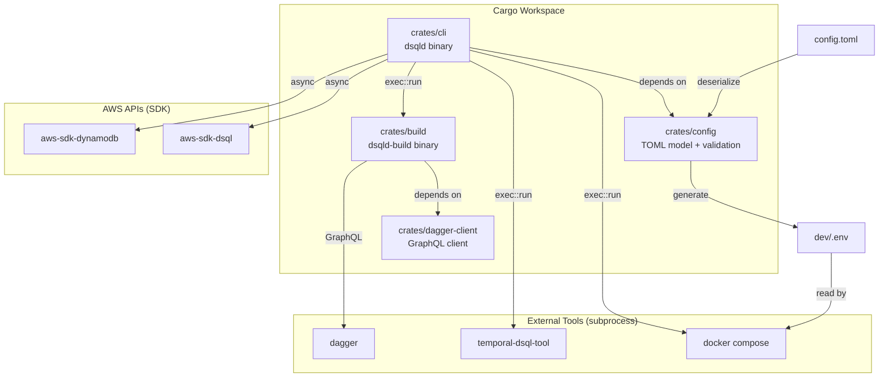
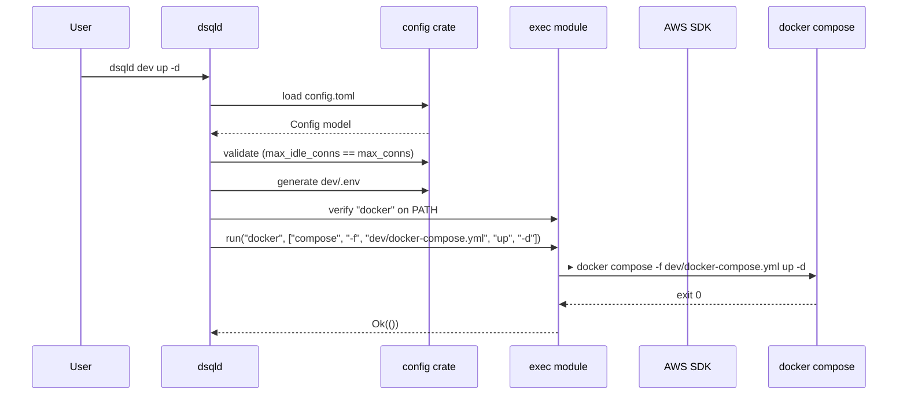

# Design Document: Rust CLI Rewrite (`dsqld`)

## Overview

This design describes the rewrite of the `temporal-dsql-deploy` Python CLI (`tdeploy`) to Rust, producing a single binary `dsqld` and a companion build binary `dsqld-build`. The rewrite converges on patterns from two sibling repos: `temporal-loom` (workspace CLI, exec module, compose wrapping) and `temporal-dsql-deploy-eks` (TOML config, Dagger client, AWS SDK infra).

The system replaces hand-edited `.env` files with a `config.toml` single source of truth, replaces Terraform with direct AWS SDK calls, and wraps Docker Compose via subprocess. The Cargo workspace contains four crates: `cli`, `config`, `build`, and `dagger-client`.

### Key Design Decisions

1. **Subprocess over library bindings** — Docker Compose and `temporal-dsql-tool` are invoked as subprocesses (matching loom-cli), not via Rust library bindings.
2. **TOML config as single source of truth** — `.env` is a derived artifact generated before every `dev` command. Developers edit `config.toml` only.
3. **Direct AWS SDK** — Terraform is removed entirely. `aws-sdk-dsql` and `aws-sdk-dynamodb` handle infrastructure.
4. **Dagger for builds** — The `dagger-client` crate is copied verbatim from `temporal-dsql-deploy-eks`.
5. **Compile-time workspace root** — `.cargo/config.toml` injects `DSQLD_WORKSPACE_ROOT` so all paths resolve without runtime discovery.
6. **Full connection management stack enabled by default** — Unlike the EKS repo (which disables DynamoDB-backed layers for dev profiles), this repo is *the* testing ground for temporal-dsql. All three layers — reservoir, distributed rate limiting (token bucket), and connection leasing (slot blocks) — default to enabled. `infra apply` always creates the DynamoDB tables.
7. **All DSQL env vars flow through generated `.env`** — The `dev/docker-compose.yml` must not hardcode any DSQL or reservoir environment variables in the `environment:` block. All configuration flows through the generated `dev/.env` via `env_file:`. This preserves the "config.toml is the single source of truth" principle. The only `environment:` entries in compose should be non-DSQL constants (e.g., `AWS_EC2_METADATA_DISABLED=true`, `TEMPORAL_PERSISTENCE_TEMPLATE=...`).
8. **Elasticsearch 8.17.0** — The visibility store uses `docker.elastic.co/elasticsearch/elasticsearch:8.17.0`, matching `temporal-loom`. The `TEMPORAL_ELASTICSEARCH_VERSION` remains `v8`. The current repo uses the older `elasticsearch:8.11.0` image — the migration updates this.

## Architecture



### Command Flow



## Components and Interfaces

### Crate: `config`

Owns the TOML configuration model, deserialization, validation, and `.env` generation.

```rust
// crates/config/src/lib.rs
pub mod model;
pub mod validate;
pub mod env;

pub use model::ProjectConfig;

/// Load and deserialize config.toml from the given path.
pub fn load_config(path: &std::path::Path) -> Result<ProjectConfig, ConfigError>;

// crates/config/src/model.rs
#[derive(Debug, Clone, Default, Serialize, Deserialize)]
pub struct ProjectConfig {
    #[serde(default)]
    pub project: ProjectSection,
    #[serde(default)]
    pub dsql: DsqlSection,
    #[serde(default)]
    pub elasticsearch: ElasticsearchSection,
    #[serde(default)]
    pub temporal: TemporalSection,
    #[serde(default)]
    pub dynamodb: DynamoDbSection,
}

// crates/config/src/validate.rs
#[derive(Debug, thiserror::Error)]
pub enum ConfigError {
    #[error("config file not found: {0}")]
    NotFound(std::path::PathBuf),
    #[error("TOML parse error: {0}")]
    Parse(#[from] toml::de::Error),
    #[error("validation error: {field} — {message}")]
    Validation { field: String, message: String },
    #[error("missing required field: {0}")]
    MissingField(String),
}

/// Validate config invariants. Returns Err on first violation.
pub fn validate(config: &ProjectConfig) -> Result<(), ConfigError>;

// crates/config/src/env.rs
/// Generate a .env file content string from the config model.
/// Maps config fields to the environment variable names expected
/// by the Docker Compose stack.
pub fn generate_env(config: &ProjectConfig) -> Result<String, ConfigError>;
```

### Crate: `cli`

The main binary. Uses `clap` derive for argument parsing, `eyre`/`color-eyre` for errors.

```rust
// crates/cli/src/main.rs
#[derive(Parser)]
#[command(name = "dsqld", about = "Temporal DSQL local development CLI")]
struct Cli {
    #[command(subcommand)]
    command: Command,
}

#[derive(Subcommand)]
enum Command {
    /// Configuration management
    Config {
        #[command(subcommand)]
        action: ConfigAction,
    },
    /// Infrastructure provisioning (AWS SDK)
    Infra {
        #[command(subcommand)]
        action: InfraAction,
    },
    /// Build Docker images via Dagger
    Build {
        #[command(subcommand)]
        action: BuildAction,
    },
    /// DSQL schema setup
    Schema {
        #[command(subcommand)]
        action: SchemaAction,
    },
    /// Docker Compose dev stack lifecycle
    Dev {
        #[command(subcommand)]
        action: DevAction,
    },
}
```

#### Subcommand Enums

```rust
// crates/cli/src/cmd/config.rs
#[derive(Subcommand)]
pub enum ConfigAction {
    /// Generate config.toml with defaults
    Init,
}

// crates/cli/src/cmd/infra.rs
#[derive(Subcommand)]
pub enum InfraAction {
    /// Provision DSQL cluster and DynamoDB tables
    Apply,
    /// Destroy provisioned resources
    Destroy,
    /// Show status of provisioned resources
    Status,
}

// crates/cli/src/cmd/build.rs
#[derive(Subcommand)]
pub enum BuildAction {
    /// Build temporal-dsql-server and temporal-dsql-tool images
    Temporal {
        /// Path to temporal-dsql source repo
        #[arg(long, env = "TEMPORAL_DSQL_PATH")]
        source: Option<std::path::PathBuf>,
        /// Target architecture
        #[arg(long, default_value = "arm64")]
        arch: String,
    },
}

// crates/cli/src/cmd/schema.rs
#[derive(Subcommand)]
pub enum SchemaAction {
    /// Apply DSQL schema
    Setup {
        /// Schema version
        #[arg(long, default_value = "1.1")]
        version: String,
        /// Overwrite existing schema
        #[arg(long)]
        overwrite: bool,
        /// Path to temporal-dsql-tool binary
        #[arg(long, default_value = "temporal-dsql-tool")]
        tool: String,
    },
}

// crates/cli/src/cmd/dev.rs
#[derive(Subcommand)]
pub enum DevAction {
    /// Start dev stack
    Up {
        /// Run in background
        #[arg(short, long)]
        detach: bool,
    },
    /// Stop dev stack
    Down {
        /// Remove volumes
        #[arg(short, long)]
        volumes: bool,
    },
    /// Show service status
    Ps,
    /// Tail service logs
    Logs {
        /// Service name
        service: Option<String>,
        /// Follow log output
        #[arg(short, long)]
        follow: bool,
    },
    /// Restart services
    Restart {
        /// Service names (all if empty)
        services: Vec<String>,
    },
}
```

### Module: `exec`

Subprocess execution from workspace root. Matches `temporal-loom/crates/loom-cli/src/exec.rs`.

```rust
// crates/cli/src/exec.rs
use eyre::{bail, Result};
use std::process::{Command, Stdio};

/// Run a command from workspace root, streaming stdio.
pub fn run(program: &str, args: &[&str]) -> Result<()>;

/// Run a command in a specific directory.
pub fn run_in(program: &str, args: &[&str], dir: &str) -> Result<()>;
```

Both functions: verify tool on PATH via `which`, print `▸ command args` to stderr, stream stdio, check exit code.

### Module: `paths`

Workspace-relative path resolution. Matches `temporal-loom/crates/loom-cli/src/paths.rs`.

```rust
// crates/cli/src/paths.rs
const WORKSPACE_ROOT: &str = env!("DSQLD_WORKSPACE_ROOT");

pub fn root() -> &'static Path;
pub fn compose_file() -> PathBuf;    // dev/docker-compose.yml
pub fn env_file() -> PathBuf;        // dev/.env
pub fn config_file() -> PathBuf;     // config.toml
pub fn docker_dir() -> PathBuf;      // docker/
```

### Crate: `build`

Separate binary (`dsqld-build`) for Dagger-based image building. Follows `temporal-dsql-deploy-eks/crates/build/src/main.rs` exactly.

```rust
// crates/build/src/main.rs
const WORKSPACE_ROOT: &str = env!("DSQLD_WORKSPACE_ROOT");

#[derive(Parser)]
#[command(name = "dsqld-build")]
struct Cli {
    #[command(subcommand)]
    command: Commands,
}

#[derive(Subcommand)]
enum Commands {
    Temporal {
        #[arg(long, env = "TEMPORAL_DSQL_PATH")]
        source: Option<PathBuf>,
        #[arg(long, default_value = "arm64")]
        arch: String,
    },
}

/// Resolve temporal-dsql repo: --source > TEMPORAL_DSQL_PATH > ../temporal-dsql
pub fn resolve_temporal_dsql_path(explicit: Option<PathBuf>) -> Result<PathBuf>;

/// Extract Go version from go.mod: "go 1.24.3" → "1.24"
pub fn go_version_from_mod(source: &Path) -> Result<String>;

/// Build temporal-dsql-server:latest and temporal-dsql-tool:latest via Dagger.
fn build_temporal(source: &Path, arch: &str) -> Result<()>;
```

### Crate: `dagger-client`

Copied verbatim from `temporal-dsql-deploy-eks/crates/dagger-client/`. Lightweight GraphQL client for Dagger. No functional changes.

### Infrastructure Module

Async AWS SDK operations for DSQL and DynamoDB, using `tokio`. DynamoDB tables are always created because this repo exercises the full DSQL connection management stack (reservoir + distributed rate limiting + connection leasing).

```rust
// crates/cli/src/cmd/infra.rs (implementation detail)

/// Create a DSQL cluster with deletion protection and project tags.
async fn create_dsql_cluster(config: &ProjectConfig) -> Result<String>; // returns endpoint

/// Create DynamoDB tables for rate limiting and connection leasing.
/// Always called — this repo exercises the full connection management stack.
async fn create_dynamodb_tables(config: &ProjectConfig) -> Result<()>;

/// Describe current infrastructure state.
async fn describe_infra(config: &ProjectConfig) -> Result<InfraStatus>;

/// Destroy infrastructure with confirmation prompt.
async fn destroy_infra(config: &ProjectConfig) -> Result<()>;
```

### Compose Helper

Wraps Docker Compose invocations, matching loom-cli's `compose()` pattern.

```rust
// crates/cli/src/cmd/dev.rs (internal)

/// Run a docker compose command against dev/docker-compose.yml.
fn compose(args: &[&str]) -> Result<()> {
    let cf = paths::compose_file();
    let mut full_args = vec!["-f", cf.to_str().unwrap()];
    full_args.extend_from_slice(args);
    exec::run("docker", &[&["compose"], &full_args[..]].concat())
}
```

## Data Models

### ProjectConfig (TOML root)

```rust
#[derive(Debug, Clone, Default, Serialize, Deserialize)]
pub struct ProjectConfig {
    #[serde(default)]
    pub project: ProjectSection,
    #[serde(default)]
    pub dsql: DsqlSection,
    #[serde(default)]
    pub elasticsearch: ElasticsearchSection,
    #[serde(default)]
    pub temporal: TemporalSection,
    #[serde(default)]
    pub dynamodb: DynamoDbSection,
}

#[derive(Debug, Clone, Serialize, Deserialize)]
pub struct ProjectSection {
    #[serde(default = "default_project_name")]
    pub name: String,          // default: "temporal-dev"
    #[serde(default = "default_region")]
    pub region: String,        // default: "eu-west-1"
}

#[derive(Debug, Clone, Serialize, Deserialize)]
pub struct DsqlSection {
    #[serde(default)]
    pub endpoint: String,      // no default — populated by infra apply
    #[serde(default = "default_5432")]
    pub port: u16,             // default: 5432
    #[serde(default = "default_admin")]
    pub user: String,          // default: "admin"
    #[serde(default = "default_postgres")]
    pub database: String,      // default: "postgres"
    #[serde(default = "default_50")]
    pub max_conns: u32,        // default: 50
    #[serde(default = "default_50")]
    pub max_idle_conns: u32,   // default: 50 (MUST equal max_conns)
    #[serde(default = "default_30s")]
    pub connection_timeout: String,
    #[serde(default = "default_55m")]
    pub max_conn_lifetime: String,
    #[serde(default)]
    pub reservoir: ReservoirConfig,
    #[serde(default)]
    pub rate_coordination: RateCoordinationConfig,
    #[serde(default)]
    pub conn_lease: ConnLeaseConfig,
}

#[derive(Debug, Clone, Serialize, Deserialize)]
pub struct ReservoirConfig {
    #[serde(default = "default_true")]
    pub enabled: bool,             // default: true
    #[serde(default = "default_50")]
    pub target_ready: u32,         // default: 50
    #[serde(default = "default_11m")]
    pub base_lifetime: String,     // default: "11m"
    #[serde(default = "default_2m")]
    pub lifetime_jitter: String,   // default: "2m"
    #[serde(default = "default_45s")]
    pub guard_window: String,      // default: "45s"
    #[serde(default = "default_8")]
    pub inflight_limit: u32,       // default: 8
}

#[derive(Debug, Clone, Serialize, Deserialize)]
pub struct RateCoordinationConfig {
    #[serde(default = "default_true")]
    pub enabled: bool,             // default: true — this repo exercises the full stack
    #[serde(default)]
    pub table_name: String,        // default: "" (derived from project name)
    #[serde(default = "default_100")]
    pub limit: u32,                // default: 100
    #[serde(default)]
    pub token_bucket: TokenBucketConfig,
}

#[derive(Debug, Clone, Serialize, Deserialize)]
pub struct TokenBucketConfig {
    #[serde(default = "default_true")]
    pub enabled: bool,             // default: true — token bucket is the recommended algorithm
    #[serde(default = "default_100")]
    pub rate: u32,                 // default: 100
    #[serde(default = "default_1000")]
    pub capacity: u32,             // default: 1000
}

#[derive(Debug, Clone, Serialize, Deserialize)]
pub struct ConnLeaseConfig {
    #[serde(default = "default_true")]
    pub enabled: bool,             // default: true — this repo exercises the full stack
    #[serde(default)]
    pub table_name: String,
    #[serde(default = "default_100")]
    pub block_size: u32,           // default: 100
    #[serde(default = "default_100")]
    pub block_count: u32,          // default: 100
    #[serde(default = "default_3m")]
    pub block_ttl: String,         // default: "3m"
    #[serde(default = "default_1m")]
    pub renew_interval: String,    // default: "1m"
}

#[derive(Debug, Clone, Serialize, Deserialize)]
pub struct ElasticsearchSection {
    #[serde(default = "default_es_host")]
    pub host: String,              // default: "elasticsearch"
    #[serde(default = "default_9200")]
    pub port: u16,                 // default: 9200
    #[serde(default = "default_http")]
    pub scheme: String,            // default: "http"
    #[serde(default = "default_v8")]
    pub version: String,           // default: "v8"
    #[serde(default = "default_es_index")]
    pub index: String,             // default: "temporal_visibility_v1_dev"
}

#[derive(Debug, Clone, Serialize, Deserialize)]
pub struct TemporalSection {
    #[serde(default = "default_info")]
    pub log_level: String,         // default: "info"
    #[serde(default = "default_4")]
    pub history_shards: u32,       // default: 4
    #[serde(default = "default_temporal_image")]
    pub image: String,             // default: "temporal-dsql-server:latest"
}

#[derive(Debug, Clone, Serialize, Deserialize)]
pub struct DynamoDbSection {
    #[serde(default)]
    pub rate_limiter_table: String,  // derived: "{project.name}-dsql-rate-limiter"
    #[serde(default)]
    pub conn_lease_table: String,    // derived: "{project.name}-dsql-conn-lease"
}
```

### Environment Variable Mapping

The `env::generate_env()` function maps config fields to the environment variable names expected by the Docker Compose stack. The mapping is a flat list of `(key, value)` pairs:

| Config Field | Environment Variable |
|---|---|
| `dsql.endpoint` | `TEMPORAL_SQL_HOST` |
| `dsql.port` | `TEMPORAL_SQL_PORT` |
| `dsql.user` | `TEMPORAL_SQL_USER` |
| `dsql.database` | `TEMPORAL_SQL_DATABASE` |
| `dsql.max_conns` | `TEMPORAL_SQL_MAX_CONNS` |
| `dsql.max_idle_conns` | `TEMPORAL_SQL_MAX_IDLE_CONNS` |
| `dsql.connection_timeout` | `TEMPORAL_SQL_CONNECTION_TIMEOUT` |
| `dsql.max_conn_lifetime` | `TEMPORAL_SQL_MAX_CONN_LIFETIME` |
| `elasticsearch.host` | `TEMPORAL_ELASTICSEARCH_HOST` |
| `elasticsearch.port` | `TEMPORAL_ELASTICSEARCH_PORT` |
| `elasticsearch.scheme` | `TEMPORAL_ELASTICSEARCH_SCHEME` |
| `elasticsearch.version` | `TEMPORAL_ELASTICSEARCH_VERSION` |
| `elasticsearch.index` | `TEMPORAL_ELASTICSEARCH_INDEX` |
| `project.region` | `AWS_REGION`, `TEMPORAL_SQL_AWS_REGION` |
| `temporal.log_level` | `TEMPORAL_LOG_LEVEL` |
| `temporal.history_shards` | `TEMPORAL_HISTORY_SHARDS` |
| `temporal.image` | `TEMPORAL_IMAGE` |
| `dsql.reservoir.enabled` | `DSQL_RESERVOIR_ENABLED` |
| `dsql.reservoir.target_ready` | `DSQL_RESERVOIR_TARGET_READY` |
| `dsql.reservoir.base_lifetime` | `DSQL_RESERVOIR_BASE_LIFETIME` |
| `dsql.reservoir.lifetime_jitter` | `DSQL_RESERVOIR_LIFETIME_JITTER` |
| `dsql.reservoir.guard_window` | `DSQL_RESERVOIR_GUARD_WINDOW` |
| `dsql.reservoir.inflight_limit` | `DSQL_RESERVOIR_INFLIGHT_LIMIT` |
| `dsql.rate_coordination.enabled` | `DSQL_DISTRIBUTED_RATE_LIMITER_ENABLED` |
| `dsql.rate_coordination.table_name` | `DSQL_DISTRIBUTED_RATE_LIMITER_TABLE` |
| `dsql.rate_coordination.limit` | `DSQL_DISTRIBUTED_RATE_LIMITER_LIMIT` |
| `dsql.rate_coordination.token_bucket.enabled` | `DSQL_TOKEN_BUCKET_ENABLED` |
| `dsql.rate_coordination.token_bucket.rate` | `DSQL_TOKEN_BUCKET_RATE` |
| `dsql.rate_coordination.token_bucket.capacity` | `DSQL_TOKEN_BUCKET_CAPACITY` |
| `dsql.conn_lease.enabled` | `DSQL_DISTRIBUTED_CONN_LEASE_ENABLED` |
| `dsql.conn_lease.table_name` | `DSQL_DISTRIBUTED_CONN_LEASE_TABLE` |
| `dsql.conn_lease.block_size` | `DSQL_SLOT_BLOCK_SIZE` |
| `dsql.conn_lease.block_count` | `DSQL_SLOT_BLOCK_COUNT` |
| `dsql.conn_lease.block_ttl` | `DSQL_SLOT_BLOCK_TTL` |
| `dsql.conn_lease.renew_interval` | `DSQL_SLOT_BLOCK_RENEW_INTERVAL` |

Static variables also emitted: `TEMPORAL_SQL_PLUGIN=dsql`, `TEMPORAL_SQL_PLUGIN_NAME=dsql`, `TEMPORAL_SQL_TLS_ENABLED=true`, `TEMPORAL_SQL_IAM_AUTH=true`.

### Workspace Layout (Post-Migration)

```
temporal-dsql-deploy/
├── .cargo/config.toml          # DSQLD_WORKSPACE_ROOT env
├── Cargo.toml                  # workspace root
├── Cargo.lock
├── config.toml                 # user config (gitignored)
├── config.example.toml         # reference config (committed)
├── crates/
│   ├── cli/                    # dsqld binary
│   │   └── src/
│   │       ├── main.rs
│   │       ├── exec.rs
│   │       ├── paths.rs
│   │       └── cmd/
│   │           ├── config.rs
│   │           ├── infra.rs
│   │           ├── build.rs
│   │           ├── schema.rs
│   │           └── dev.rs
│   ├── config/                 # TOML model + validation + env gen
│   │   └── src/
│   │       ├── lib.rs
│   │       ├── model.rs
│   │       ├── validate.rs
│   │       └── env.rs
│   ├── build/                  # dsqld-build binary
│   │   └── src/main.rs
│   └── dagger-client/          # copied from EKS repo
│       └── src/lib.rs
├── dev/                        # flattened from profiles/dsql/
│   ├── docker-compose.yml
│   ├── .env                    # generated (gitignored)
│   ├── config/                 # Alloy, Mimir, Grafana configs
│   └── dynamicconfig/
├── docker/                     # shared Docker assets
│   ├── config/
│   └── render-and-start.sh
├── grafana/                    # dashboard JSON
├── dsql-tests/                 # Python integration tests
│   └── pyproject.toml          # independent Python deps
├── AGENTS.md
└── README.md
```

## Correctness Properties

*A property is a characteristic or behavior that should hold true across all valid executions of a system — essentially, a formal statement about what the system should do. Properties serve as the bridge between human-readable specifications and machine-verifiable correctness guarantees.*

### Property 1: Config TOML round-trip

*For any* valid `ProjectConfig` instance, serializing it to TOML and then deserializing the TOML string back into a `ProjectConfig` should produce a value equivalent to the original.

**Validates: Requirements 2.1, 2.7**

### Property 2: Default config has sensible defaults

*For any* field in a default-constructed `ProjectConfig`, all fields except `dsql.endpoint` should have a non-empty or meaningful default value. Specifically, `dsql.endpoint` should be empty, and `temporal.image` should be `"temporal-dsql-server:latest"`.

**Validates: Requirements 2.3, 11.2**

### Property 3: Pool invariant validation

*For any* `ProjectConfig` where `dsql.max_idle_conns` does not equal `dsql.max_conns`, calling `validate()` should return a `ConfigError::Validation` error referencing the `max_idle_conns` field.

**Validates: Requirements 2.8**

### Property 4: Env generation round-trip

*For any* valid `ProjectConfig` with a non-empty `dsql.endpoint`, generating the `.env` string via `generate_env()` and then parsing the resulting key-value pairs back should produce values that match the original config fields for every mapped variable.

**Validates: Requirements 3.2, 3.5**

### Property 5: Missing endpoint prevents env generation

*For any* `ProjectConfig` where `dsql.endpoint` is empty, calling `generate_env()` should return an error identifying the missing field.

**Validates: Requirements 3.4**

### Property 6: Project name prefix for resource names

*For any* non-empty project name string, the generated DSQL cluster name should be prefixed with that project name, and the generated DynamoDB table names should be `"{project_name}-dsql-rate-limiter"` and `"{project_name}-dsql-conn-lease"`.

**Validates: Requirements 4.6**

### Property 7: Go version extraction

*For any* valid `go X.Y.Z` directive in a `go.mod` file (where X, Y, Z are non-negative integers), `go_version_from_mod()` should produce the string `"X.Y"` (major.minor only, patch stripped).

**Validates: Requirements 5.4, 5.8**

### Property 8: Schema tool args derived from config

*For any* valid `ProjectConfig` with a non-empty `dsql.endpoint`, the schema tool argument builder should produce arguments containing the endpoint, port, user, database, and region values from the config, in the format expected by `temporal-dsql-tool`.

**Validates: Requirements 6.2**

### Property 9: Path functions resolve under workspace root

*For any* path returned by `paths::compose_file()`, `paths::env_file()`, `paths::config_file()`, or `paths::docker_dir()`, the path should start with the value of `paths::root()`.

**Validates: Requirements 8.3, 12.2**

## Error Handling

### Error Strategy by Crate

| Crate | Library | Approach |
|-------|---------|----------|
| `config` | `thiserror` | Typed errors: `ConfigError::NotFound`, `ConfigError::Parse`, `ConfigError::Validation`, `ConfigError::MissingField` |
| `cli` | `eyre` + `color-eyre` | Wrap all errors with context via `.wrap_err()`. `color-eyre` provides colored backtraces on panic. |
| `build` | `eyre` | Same as cli. `bail!()` for early returns. |
| `dagger-client` | `eyre` | Copied from EKS repo, unchanged. |

### Error Scenarios

| Scenario | Behavior |
|----------|----------|
| `config.toml` not found | `ConfigError::NotFound` with path |
| TOML syntax error | `ConfigError::Parse` with line/column from `toml` |
| `max_idle_conns != max_conns` | `ConfigError::Validation` with field name and explanation |
| `dsql.endpoint` empty on env gen | `ConfigError::MissingField("dsql.endpoint")` |
| `config.toml` exists on `config init` | Error message, exit 1 |
| `docker` not on PATH | `eyre` error: `"'docker' not found on PATH — is it installed?"` |
| `temporal-dsql-tool` not found | `eyre` error with hint to build it first |
| Subprocess exits non-zero | `eyre` error: `"'{program}' exited with code {code}"` |
| AWS permission error | `eyre` error with remediation hint |
| AWS retryable error | SDK built-in retry policy handles it |
| `go.mod` missing `go` directive | `eyre` error: `"Could not find 'go' directive in go.mod"` |
| Source dir missing `go.mod` | `eyre` error: `"'{path}' does not look like a Go repo (no go.mod found)"` |

### Exit Code Propagation

The `exec` module propagates subprocess exit codes. When a subprocess fails, the CLI exits with the same code. This ensures that `dsqld dev up` failing because `docker compose up` failed returns Docker's exit code to the caller.

## Testing Strategy

### Dual Testing Approach

Both unit tests and property-based tests are required for comprehensive coverage.

- **Unit tests**: Specific examples, edge cases, error conditions, integration points
- **Property tests**: Universal properties across randomly generated inputs

### Property-Based Testing

- **Library**: `proptest` (already used in the EKS repo's `dagger-client` and `build` crates)
- **Minimum iterations**: 100 per property test (proptest default is 256, which exceeds this)
- **Each property test must reference its design document property** via a comment tag

Tag format: `Feature: rust-cli-rewrite, Property {number}: {property_text}`

Each correctness property above maps to exactly one `proptest!` test:

| Property | Test Location | Generator Strategy |
|----------|---------------|-------------------|
| 1: Config TOML round-trip | `crates/config/src/model.rs` | Generate random `ProjectConfig` with valid string fields |
| 2: Default config defaults | `crates/config/src/model.rs` | No generator needed — test the `Default` impl |
| 3: Pool invariant validation | `crates/config/src/validate.rs` | Generate random `(max_conns, max_idle_conns)` pairs where they differ |
| 4: Env round-trip | `crates/config/src/env.rs` | Generate random valid `ProjectConfig` with non-empty endpoint |
| 5: Missing endpoint error | `crates/config/src/env.rs` | Generate random `ProjectConfig` with empty endpoint |
| 6: Project name prefix | `crates/cli/src/cmd/infra.rs` | Generate random project name strings |
| 7: Go version extraction | `crates/build/src/main.rs` | Generate random `(major, minor, patch)` tuples |
| 8: Schema args from config | `crates/cli/src/cmd/schema.rs` | Generate random valid `ProjectConfig` |
| 9: Paths under root | `crates/cli/src/paths.rs` | No generator needed — deterministic paths |

### Unit Test Coverage

Unit tests cover specific examples and edge cases not handled by property tests:

- `config init` generates valid TOML (example)
- `config init` refuses to overwrite existing file (example)
- `go.mod` with no `go` directive returns error (example)
- `go.mod` with `go 1.24` (no patch) returns `"1.24"` (example)
- Source dir without `go.mod` returns error (example)
- `exec::run` with non-existent tool returns error (example)
- `exec::run` prints `▸` prefix to stderr (example)
- `docker` not on PATH returns clear error (example)
- CLI argument parsing: `--detach`, `--volumes`, `--follow`, service names (examples)
